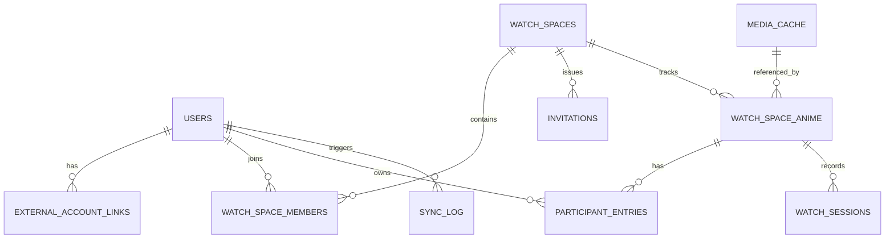
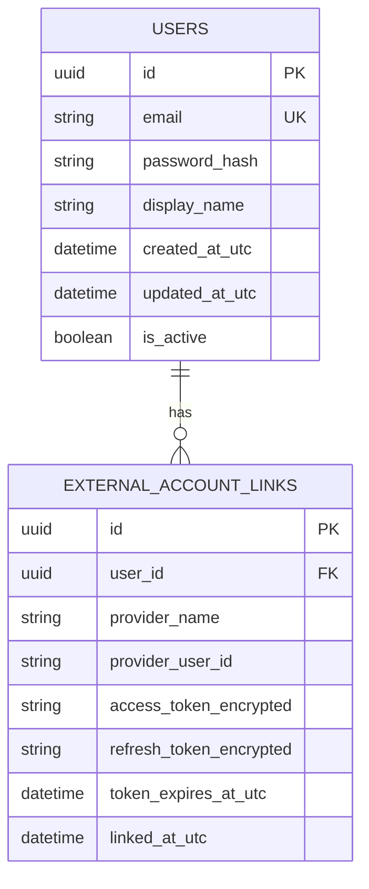
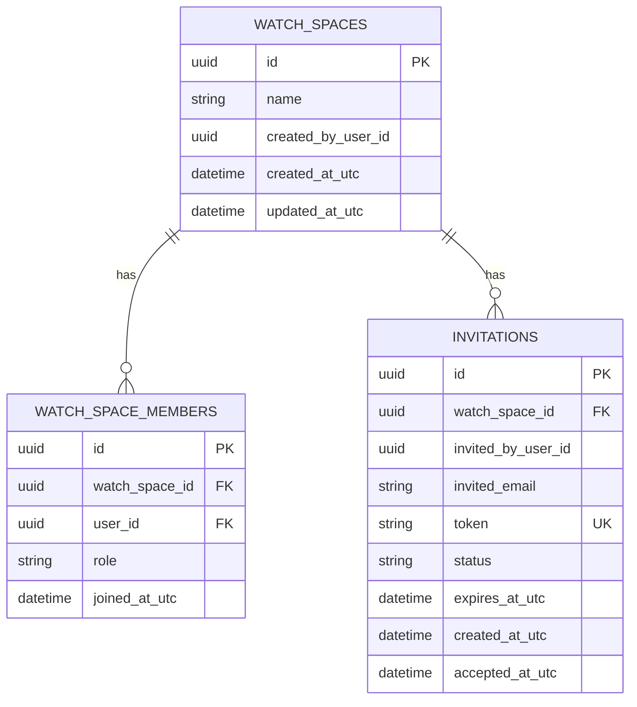
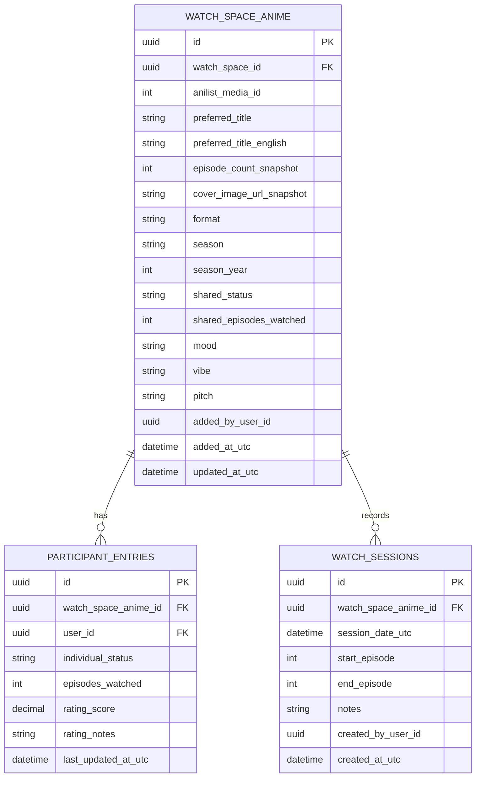
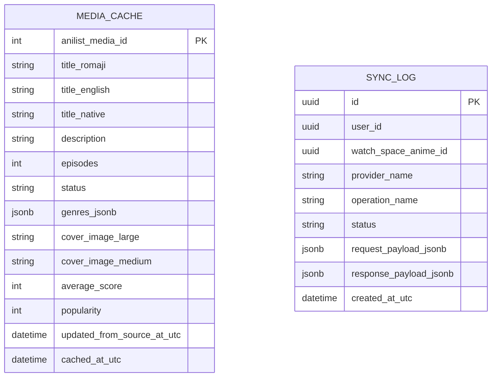
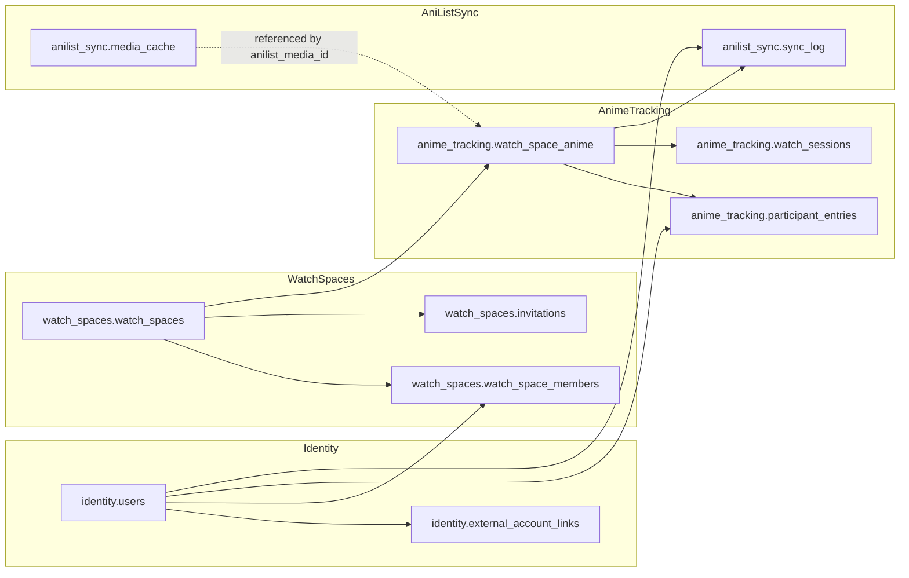

# Shared Anime Tracker — Design Document

## 1. Overview

### 1.1 Working title

BloomWatch

### 1.2 Product summary

BloomWatch is a shared anime tracking platform for pairs and small groups. It combines personal anime tracking with a shared experience layer: joint backlog management, separate ratings, compatibility analytics, watch session history, and optional AniList synchronization.

The system will use:

* a modular monolith backend built with .NET and Domain-Driven Design (DDD)
* a PostgreSQL database
* an Angular frontend
* AniList integration for anime metadata and optional user progress sync

### 1.3 Product goals

* Let two users track anime together without requiring both to use AniList
* Avoid maintaining a full internal anime catalog by relying on AniList metadata
* Provide a strong collaborative experience layer on top of anime tracking
* Support phased implementation from MVP to richer analytics and sync features
* Keep the backend simple to deploy initially while preserving clean domain boundaries for future extraction into services if needed

### 1.4 Non-goals for initial versions

* Replacing AniList as a full anime social platform
* Supporting every media type on day one
* Real-time multiplayer collaboration everywhere
* Building a recommendation engine in phase 1
* Building native mobile apps in initial delivery

---

## 2. Core user problems

### 2.1 Problems to solve

Users who watch anime together currently rely on:

* separate AniList/MyAnimeList accounts
* spreadsheets
* Notion pages
* Obsidian notes
* Discord messages

These approaches do not provide a unified shared experience for:

* joint backlog decisions
* combined progress tracking
* side-by-side ratings
* compatibility analysis
* watch history and shared notes

### 2.2 Target users

Primary:

* couples who watch anime together
* close friends who share an anime backlog

Secondary:

* roommates
* small anime clubs
* Discord watch groups

---

## 3. Product scope

### 3.1 Core concepts

The product is centered around these concepts:

* **User**: an account in BloomWatch
* **Watch Space**: a shared space for two or more users
* **Anime Entry**: an anime added to a watch space, referencing AniList metadata
* **Participant Progress**: each user’s individual progress and status for that anime
* **Shared Progress**: progress of the anime in the context of the watch space
* **Rating**: per-user score and notes
* **Watch Session**: an event capturing what was watched together
* **AniList Link**: optional link between a BloomWatch user and their AniList account

### 3.2 Product pillars

* **Cute and personal**: emotionally warm, expressive, aesthetic UX
* **Analytical**: compatibility scores, rating gaps, progress visuals
* **Flexible**: usable with or without AniList linking
* **Incremental**: designed for phased rollout

---

## 4. Architecture

### 4.1 High-level architecture

BloomWatch will be implemented as a modular monolith with clear domain boundaries.

#### Frontend

* Angular
* Feature-based architecture
* Signal-based state where appropriate
* Angular Material or custom themed component system
* Charts for ratings and compatibility visuals

#### Backend

* .NET ASP.NET Core
* Modular monolith
* DDD-inspired modules
* PostgreSQL
* EF Core
* Internal integration through application services, domain events, and module contracts

#### External integration

* AniList GraphQL API
* OAuth-based optional AniList account linking

### 4.2 Why modular monolith

A modular monolith is ideal because:

* product scope is still evolving
* domain complexity is meaningful enough to justify explicit module boundaries
* deployment and local development stay simple
* modules can later be extracted if growth demands it

### 4.3 Architectural style

Each module will have:

* Domain
* Application
* Infrastructure
* API contracts/internal contracts

Suggested solution layout:

```text
src/
  BloomWatch.Api/
  BloomWatch.SharedKernel/
  Modules/
    Identity/
      BloomWatch.Modules.Identity.Domain/
      BloomWatch.Modules.Identity.Application/
      BloomWatch.Modules.Identity.Infrastructure/
      BloomWatch.Modules.Identity.Contracts/
    WatchSpaces/
      BloomWatch.Modules.WatchSpaces.Domain/
      BloomWatch.Modules.WatchSpaces.Application/
      BloomWatch.Modules.WatchSpaces.Infrastructure/
      BloomWatch.Modules.WatchSpaces.Contracts/
    AnimeTracking/
      BloomWatch.Modules.AnimeTracking.Domain/
      BloomWatch.Modules.AnimeTracking.Application/
      BloomWatch.Modules.AnimeTracking.Infrastructure/
      BloomWatch.Modules.AnimeTracking.Contracts/
    Analytics/
      BloomWatch.Modules.Analytics.Domain/
      BloomWatch.Modules.Analytics.Application/
      BloomWatch.Modules.Analytics.Infrastructure/
      BloomWatch.Modules.Analytics.Contracts/
    AniListSync/
      BloomWatch.Modules.AniListSync.Domain/
      BloomWatch.Modules.AniListSync.Application/
      BloomWatch.Modules.AniListSync.Infrastructure/
      BloomWatch.Modules.AniListSync.Contracts/
```

---

## 5. Domain modules

## 5.1 Identity module

### Responsibilities

* user registration
* login/logout
* token issuance
* profile management
* AniList account linking metadata

### Aggregate roots

* User
* ExternalAccountLink

### Key entities/value objects

* UserId
* DisplayName
* EmailAddress
* AniListAccountLink

### Notes

This module owns authentication and the concept of a platform user.

---

## 5.2 WatchSpaces module

### Responsibilities

* create watch spaces
* invite/join members
* manage membership roles
* enforce watch space ownership rules

### Aggregate roots

* WatchSpace

### Entities

* WatchSpaceMember
* Invitation

### Business rules

* a watch space must have at least one owner
* a user may belong to many watch spaces
* invitations may expire
* roles may start simple: Owner, Member

---

## 5.3 AnimeTracking module

### Responsibilities

* add anime to a watch space
* manage shared status/backlog/watching/finished/paused/dropped
* track individual user ratings and notes
* store shared anime details specific to a watch space
* record watch sessions

### Aggregate roots

* WatchSpaceAnime

### Entities

* ParticipantEntry
* WatchSession
* Rating

### Value objects

* Progress
* AnimeStatus
* Score
* AniListMediaReference

### Notes

This is the heart of the product.

---

## 5.4 Analytics module

### Responsibilities

* compatibility score calculation
* rating gap analysis
* aggregate watch statistics
* dashboard summaries

### Style

Prefer read-model driven calculations at first, with some reusable domain services for stable formulas.

### Outputs

* compatibility score per watch space
* most aligned anime
* biggest rating gaps
* shared completion statistics
* episodes watched together

---

## 5.5 AniListSync module

### Responsibilities

* search AniList for anime metadata
* cache anime metadata
* manage AniList OAuth tokens
* optionally push progress/status/rating updates to AniList
* optionally import user watchlist data later

### Important boundary

AniListSync does not own BloomWatch business rules. It only translates between BloomWatch and AniList.

---

## 6. Bounded contexts and ownership

| Module        | Owns                                                  | Reads from                                        |
| ------------- | ----------------------------------------------------- | ------------------------------------------------- |
| Identity      | users, auth, external links                           | none                                              |
| WatchSpaces   | watch spaces, membership, invitations                 | Identity                                          |
| AnimeTracking | shared anime, participant progress, sessions, ratings | WatchSpaces, Identity, AniListSync reference data |
| Analytics     | dashboard projections, compatibility, summaries       | AnimeTracking, WatchSpaces                        |
| AniListSync   | AniList metadata cache, tokens, sync logs             | Identity, AnimeTracking                           |

Rules:

* Only a module writes to its own tables.
* Cross-module operations should happen through contracts/application services.
* Read models can denormalize across modules.

---

## 7. Domain model detail

## 7.1 WatchSpace aggregate

### Fields

* WatchSpaceId
* Name
* CreatedByUserId
* CreatedAtUtc
* Theme (optional later)
* Members
* Invitations

### Behaviors

* Create
* Rename
* InviteMember
* AcceptInvitation
* RemoveMember
* TransferOwnership

---

## 7.2 WatchSpaceAnime aggregate

### Fields

* WatchSpaceAnimeId
* WatchSpaceId
* AniListMediaId
* PreferredTitle
* SharedStatus
* SharedEpisodesWatched
* EpisodeCountSnapshot
* CoverImageUrlSnapshot
* Mood
* Vibe
* Pitch
* AddedByUserId
* AddedAtUtc
* ParticipantEntries
* WatchSessions

### Behaviors

* AddToWatchSpace
* UpdateSharedStatus
* UpdateSharedProgress
* RecordWatchSession
* SetMoodVibePitch
* AddOrUpdateParticipantRating
* AddParticipantProgress

### Why store snapshots

Even though AniList is the source of truth for metadata, we should store selected snapshots:

* preferred display title
* episode count snapshot
* cover image url snapshot

This improves performance and preserves historical consistency.

---

## 7.3 ParticipantEntry entity

### Fields

* ParticipantEntryId
* UserId
* IndividualStatus
* EpisodesWatched
* RatingScore
* RatingNotes
* LastUpdatedAtUtc

### Behaviors

* UpdateProgress
* UpdateStatus
* RateAnime
* ClearRating

---

## 7.4 WatchSession entity

### Fields

* WatchSessionId
* WatchSpaceAnimeId
* SessionDateUtc
* StartEpisode
* EndEpisode
* Notes
* CreatedByUserId

### Behaviors

* CreateSession
* EditNotes

---

## 8. Database design

### 8.1 Database design goals

The BloomWatch database should support a modular monolith while still keeping relational integrity strong and understandable.

Primary goals:

* keep transactional data normalized
* make table ownership clear by module
* preserve a clean boundary between BloomWatch domain data and AniList reference data
* avoid duplicating large amounts of external metadata
* allow efficient querying for dashboards and watch-space views
* support future projections/read models without corrupting the write model

This design uses **PostgreSQL** as the primary relational store.

---

### 8.2 Schema strategy

Each module owns its own schema:

* `identity`
* `watch_spaces`
* `anime_tracking`
* `analytics`
* `anilist_sync`

This gives the modular monolith a stronger internal structure:

* tables are grouped by business responsibility
* migrations are easier to reason about
* ownership stays explicit
* future extraction into separate services becomes easier

Even though this is a monolith, the schemas help reinforce bounded contexts.

---

### 8.3 Normalization strategy

The core transactional model should target roughly **third normal form (3NF)** where practical.

That means:

* each table represents one main concept
* non-key columns depend on the key, the whole key, and nothing but the key
* repeating groups are split into related tables
* many-to-many relationships are resolved with join tables
* derived/aggregated values should usually not be stored unless there is a strong business or performance reason

Examples in BloomWatch:

* watch-space membership is separated into `watch_space_members`
* participant-specific progress is separated from shared anime state
* AniList metadata cache is separated from watch-space anime entries
* sync logs are separated from both users and anime entries because they represent integration events, not core business state

Some **intentional denormalization** is still useful:

* `watch_space_anime.preferred_title`
* `watch_space_anime.episode_count_snapshot`
* `watch_space_anime.cover_image_url_snapshot`

These are snapshots taken from AniList so that:

* the UI loads faster
* historical consistency is preserved
* the app still has usable display data even if AniList metadata changes later

So the design is **normalized by default, denormalized selectively**.

---

### 8.4 Core relationship overview



### Low-level explanation

This is the highest-level relational picture:

* a **user** can exist in many watch spaces
* a **watch space** has many members
* a **watch space** can track many anime
* each anime inside a watch space can have many participant-specific entries
* each anime inside a watch space can also have many watch sessions
* AniList metadata is stored separately in cache and referenced logically by AniList media ID

This separation matters because the app is not just storing “anime.”
It is storing:

* shared anime in a specific watch space
* each person’s personal relationship to that anime
* joint sessions/history
* external metadata from AniList

Those are different concepts and deserve different tables.

---

## 8.5 Identity schema

The `identity` schema owns platform users and third-party account links.

### Tables

#### `identity.users`

Represents a BloomWatch user account.

Columns:

* `id` uuid pk
* `email` varchar unique not null
* `password_hash` text not null
* `display_name` varchar not null
* `created_at_utc` timestamptz not null
* `updated_at_utc` timestamptz not null
* `is_active` boolean not null

#### `identity.external_account_links`

Represents a linked third-party identity such as AniList.

Columns:

* `id` uuid pk
* `user_id` uuid not null fk -> `identity.users.id`
* `provider_name` varchar not null
* `provider_user_id` varchar not null
* `access_token_encrypted` text not null
* `refresh_token_encrypted` text nullable
* `token_expires_at_utc` timestamptz nullable
* `linked_at_utc` timestamptz not null

Recommended constraints:

* unique(`provider_name`, `provider_user_id`)
* unique(`user_id`, `provider_name`)

### Identity diagram



### Low-level normalization notes

This is normalized because:

* user identity data is stored once in `users`
* provider-specific linkage data is stored separately
* one user may link multiple providers later, even if MVP only uses AniList
* token data does not belong in the user row because it is optional and provider-specific

---

## 8.6 Watch spaces schema

The `watch_spaces` schema owns collaborative grouping: spaces, members, and invitations.

### Tables

#### `watch_spaces.watch_spaces`

Represents a collaborative space.

Columns:

* `id` uuid pk
* `name` varchar not null
* `created_by_user_id` uuid not null
* `created_at_utc` timestamptz not null
* `updated_at_utc` timestamptz not null

#### `watch_spaces.watch_space_members`

Represents the many-to-many relationship between users and watch spaces.

Columns:

* `id` uuid pk
* `watch_space_id` uuid not null fk -> `watch_spaces.watch_spaces.id`
* `user_id` uuid not null fk -> `identity.users.id`
* `role` varchar not null
* `joined_at_utc` timestamptz not null

Recommended constraints:

* unique(`watch_space_id`, `user_id`)

#### `watch_spaces.invitations`

Represents invitation workflow.

Columns:

* `id` uuid pk
* `watch_space_id` uuid not null fk -> `watch_spaces.watch_spaces.id`
* `invited_by_user_id` uuid not null
* `invited_email` varchar not null
* `token` varchar unique not null
* `status` varchar not null
* `expires_at_utc` timestamptz not null
* `created_at_utc` timestamptz not null
* `accepted_at_utc` timestamptz nullable

### Watch spaces diagram



### Low-level normalization notes

This is normalized because:

* watch space data is not duplicated in membership rows
* membership is modeled as its own table because users and watch spaces are many-to-many
* invitations are separate because they are workflow objects, not members

Why not store members as a JSON list on `watch_spaces`?

Because that would make it harder to:

* enforce uniqueness
* query membership efficiently
* track roles and joined dates cleanly
* maintain relational integrity

A join table is the correct relational design here.

---

## 8.7 Anime tracking schema

The `anime_tracking` schema owns the heart of the product: anime inside a watch space, participant-specific tracking, and shared watch history.

### Tables

#### `anime_tracking.watch_space_anime`

Represents an anime tracked inside a specific watch space.

Columns:

* `id` uuid pk
* `watch_space_id` uuid not null fk -> `watch_spaces.watch_spaces.id`
* `anilist_media_id` int not null
* `preferred_title` varchar not null
* `preferred_title_english` varchar nullable
* `episode_count_snapshot` int nullable
* `cover_image_url_snapshot` text nullable
* `format` varchar nullable
* `season` varchar nullable
* `season_year` int nullable
* `shared_status` varchar not null
* `shared_episodes_watched` int not null default 0
* `mood` text nullable
* `vibe` text nullable
* `pitch` text nullable
* `added_by_user_id` uuid not null
* `added_at_utc` timestamptz not null
* `updated_at_utc` timestamptz not null

Recommended constraint:

* unique(`watch_space_id`, `anilist_media_id`)

This prevents accidental duplicate tracking of the same show inside the same watch space.

#### `anime_tracking.participant_entries`

Represents one participant’s progress/rating for one anime in one watch space.

Columns:

* `id` uuid pk
* `watch_space_anime_id` uuid not null fk -> `anime_tracking.watch_space_anime.id`
* `user_id` uuid not null fk -> `identity.users.id`
* `individual_status` varchar not null
* `episodes_watched` int not null default 0
* `rating_score` numeric(3,1) nullable
* `rating_notes` text nullable
* `last_updated_at_utc` timestamptz not null

Recommended constraint:

* unique(`watch_space_anime_id`, `user_id`)

This ensures one participant entry per user per tracked anime.

#### `anime_tracking.watch_sessions`

Represents a shared watch event.

Columns:

* `id` uuid pk
* `watch_space_anime_id` uuid not null fk -> `anime_tracking.watch_space_anime.id`
* `session_date_utc` timestamptz not null
* `start_episode` int not null
* `end_episode` int not null
* `notes` text nullable
* `created_by_user_id` uuid not null
* `created_at_utc` timestamptz not null

### Anime tracking diagram



### Low-level normalization notes

This part is especially important.

#### Why `watch_space_anime` exists

This table is **not** a global anime catalog.
It represents:

> “This AniList anime is being tracked inside this specific watch space.”

That means the same AniList anime can appear in many watch spaces, each with different:

* shared status
* shared progress
* mood/vibe/pitch
* added date
* participant entries
* watch sessions

So `watch_space_anime` is a contextual entity, not a master catalog row.

#### Why `participant_entries` is separate

Participant-specific data should not live directly on `watch_space_anime` because it would violate normalization.

For example, if two users are watching the same anime together:

* one may be at episode 8
* another may be at episode 10
* one may rate it 9.5
* another may rate it 7

That data repeats per person, so it belongs in a child table.

#### Why `watch_sessions` is separate

A watch session is an event/history record, not a current-state field.

If session history were flattened onto `watch_space_anime`, you would lose:

* chronology
* session notes
* multiple viewings
* auditability

So sessions need their own table.

---

## 8.8 AniList sync schema

The `anilist_sync` schema owns external metadata caching and sync observability.

### Tables

#### `anilist_sync.media_cache`

Represents cached AniList metadata.

Columns:

* `anilist_media_id` int pk
* `title_romaji` varchar not null
* `title_english` varchar nullable
* `title_native` varchar nullable
* `description` text nullable
* `episodes` int nullable
* `status` varchar nullable
* `genres_jsonb` jsonb nullable
* `cover_image_large` text nullable
* `cover_image_medium` text nullable
* `average_score` int nullable
* `popularity` int nullable
* `updated_from_source_at_utc` timestamptz not null
* `cached_at_utc` timestamptz not null

#### `anilist_sync.sync_log`

Represents provider interaction history.

Columns:

* `id` uuid pk
* `user_id` uuid not null
* `watch_space_anime_id` uuid nullable
* `provider_name` varchar not null
* `operation_name` varchar not null
* `status` varchar not null
* `request_payload_jsonb` jsonb nullable
* `response_payload_jsonb` jsonb nullable
* `created_at_utc` timestamptz not null

### AniList sync diagram



### Low-level normalization notes

#### Why `media_cache` is separate

AniList data is external reference data. It should not be mixed directly into core BloomWatch transactional tables.

Keeping it separate makes it clear that:

* AniList owns that metadata
* BloomWatch only caches it
* refresh policies can evolve independently
* cache invalidation and synchronization concerns stay isolated

#### Why `sync_log` is separate

Sync operations are operational events, not part of the domain’s core current state.

A sync log can have many rows for the same user and same anime over time, which makes it a classic append-only/log-style table.

That makes it appropriate for:

* troubleshooting
* user-visible sync history later
* retries and observability
* auditing integration failures

---

## 8.9 Cross-schema reference diagram

This view shows how the schemas depend on one another.



### Design note

The dotted line between `media_cache` and `watch_space_anime` reflects an important design nuance:

* relationally, you *can* enforce a foreign key if desired using `anilist_media_id`
* conceptually, `media_cache` is still reference/cache data, not the owner of the anime-tracking record

You can choose either of these approaches:

#### Option A: No FK to `media_cache`

Use `anilist_media_id` as a logical reference only.

Pros:

* looser coupling
* safer when cache rows expire or are refreshed differently
* cleaner boundary between transactional data and cache data

#### Option B: FK to `media_cache(anilist_media_id)`

Use a real foreign key.

Pros:

* stronger referential integrity
* guarantees local cache existence when a tracked anime exists

For BloomWatch, I would lean toward **Option A initially** because `media_cache` is infrastructure/reference data, not domain-owned data.

---

## 8.10 Recommended indexes

Indexes should support the main user workflows.

### Identity

* unique index on `identity.users(email)`
* unique index on `identity.external_account_links(provider_name, provider_user_id)`
* unique index on `identity.external_account_links(user_id, provider_name)`

### Watch spaces

* unique index on `watch_spaces.watch_space_members(watch_space_id, user_id)`
* index on `watch_spaces.invitations(token)`
* index on `watch_spaces.invitations(watch_space_id, status)`

### Anime tracking

* unique index on `anime_tracking.watch_space_anime(watch_space_id, anilist_media_id)`
* unique index on `anime_tracking.participant_entries(watch_space_anime_id, user_id)`
* index on `anime_tracking.watch_space_anime(watch_space_id, shared_status)`
* index on `anime_tracking.watch_sessions(watch_space_anime_id, session_date_utc desc)`

### AniList sync

* index on `anilist_sync.sync_log(user_id, created_at_utc desc)`
* index on `anilist_sync.sync_log(watch_space_anime_id, created_at_utc desc)`
* index on `anilist_sync.media_cache(cached_at_utc)`

---

## 8.11 Integrity rules at the database level

Some rules should be enforced in the database, not only in application code.

Recommended examples:

### `anime_tracking.watch_space_anime`

* `shared_episodes_watched >= 0`

### `anime_tracking.participant_entries`

* `episodes_watched >= 0`
* `rating_score between 0.5 and 10.0` if using 0.5-step rating scale

### `anime_tracking.watch_sessions`

* `start_episode > 0`
* `end_episode >= start_episode`

### `watch_spaces.invitations`

* `expires_at_utc > created_at_utc`

These can be implemented with PostgreSQL `check` constraints.

---

## 8.12 Future analytics/read-model note

The normalized design above is ideal for the **write model** and transactional correctness.

However, analytics-heavy views may later benefit from read models such as:

* `analytics.watch_space_dashboard_projection`
* `analytics.compatibility_projection`
* `analytics.rating_gap_projection`

These projections can be updated:

* synchronously in simple MVP form
* asynchronously with domain events later

That lets the transactional model stay clean while still supporting fast dashboards.

---

## 8.13 Final database recommendation

BloomWatch should keep its transactional core normalized:

* users and provider links in `identity`
* spaces, members, and invitations in `watch_spaces`
* tracked anime, participant state, and watch sessions in `anime_tracking`
* external metadata cache and sync logs in `anilist_sync`

This structure gives you:

* strong relational clarity
* cleaner DDD boundaries
* good long-term maintainability
* enough flexibility to add projections later without redesigning the core

The most important modeling decision is this:

> **BloomWatch does not own anime metadata as a catalog product. It owns the shared relational experience around anime.**

That principle is what keeps the schema clean.

---

## 9. API design

### 9.1 API style

* REST for most application endpoints
* backend-to-AniList uses GraphQL internally
* keep public backend API simple and client-friendly

### 9.2 Endpoint groups

#### Identity

* `POST /api/auth/register`
* `POST /api/auth/login`
* `GET /api/me`
* `POST /api/me/anilist/link`
* `POST /api/me/anilist/callback`
* `DELETE /api/me/anilist/link`

#### Watch spaces

* `GET /api/watch-spaces`
* `POST /api/watch-spaces`
* `GET /api/watch-spaces/{id}`
* `POST /api/watch-spaces/{id}/invitations`
* `POST /api/watch-spaces/invitations/{token}/accept`
* `DELETE /api/watch-spaces/{id}/members/{userId}`

#### Anime tracking

* `GET /api/watch-spaces/{id}/anime`
* `POST /api/watch-spaces/{id}/anime`
* `GET /api/watch-spaces/{id}/anime/{watchSpaceAnimeId}`
* `PATCH /api/watch-spaces/{id}/anime/{watchSpaceAnimeId}`
* `PATCH /api/watch-spaces/{id}/anime/{watchSpaceAnimeId}/participant-progress`
* `PATCH /api/watch-spaces/{id}/anime/{watchSpaceAnimeId}/participant-rating`
* `POST /api/watch-spaces/{id}/anime/{watchSpaceAnimeId}/sessions`

#### Analytics

* `GET /api/watch-spaces/{id}/dashboard`
* `GET /api/watch-spaces/{id}/analytics/compatibility`
* `GET /api/watch-spaces/{id}/analytics/rating-gaps`
* `GET /api/watch-spaces/{id}/analytics/shared-stats`
* `GET /api/watch-spaces/{id}/analytics/random-pick`

#### AniList discovery

* `GET /api/anilist/search?query=...`
* `GET /api/anilist/media/{anilistMediaId}`

### 9.3 Example response shape

Use feature-specific DTOs. Avoid exposing EF entities.

Example dashboard response:

```json
{
  "watchSpaceId": "...",
  "stats": {
    "totalShows": 27,
    "currentlyWatching": 3,
    "finished": 11,
    "episodesWatchedTogether": 184
  },
  "compatibility": {
    "score": 87,
    "averageGap": 1.3,
    "ratedTogetherCount": 9,
    "label": "Very synced, with a little spice"
  },
  "currentlyWatching": [],
  "backlogHighlights": [],
  "ratingGapHighlights": []
}
```

---

## 10. Frontend design

### 10.1 Angular architecture

Use a feature-based Angular structure.

```text
src/app/
  core/
    auth/
    api/
    interceptors/
    layout/
  shared/
    ui/
    models/
    utils/
  features/
    auth/
    dashboard/
    watch-spaces/
    anime/
    analytics/
    settings/
```

### 10.2 Primary pages

* Landing page
* Login/Register
* Watch space selector
* Watch space dashboard
* Anime detail page
* Analytics page
* Settings / AniList linking page

### 10.3 Dashboard sections

* snapshot cards
* compatibility score
* currently watching with progress bars
* backlog
* random pick card
* shared ratings graph
* biggest rating gaps
* recent watch sessions

### 10.4 Frontend state approach

* route-driven data loading
* service layer around HTTP APIs
* signals for local UI state where useful
* lightweight state management first; avoid introducing NgRx unless complexity justifies it

### 10.5 UI theming

Support a cute, expressive theme system early:

* pastel mode
* dark mode
* themed watch space accents later

---

## 11. Key business rules

### 11.1 Membership

* only members of a watch space can see its anime entries
* only owners can manage invitations and remove members initially

### 11.2 Anime tracking

* a watch space cannot contain duplicate AniList media IDs more than once unless explicitly allowed later
* participant entry must be unique per user per watch-space-anime
* ratings must be constrained to a configured scale, e.g. 0.5 to 10
* progress cannot exceed known episode count when episode count is known

### 11.3 AniList sync

* AniList sync is optional and user-specific
* one user linking AniList must not force sync for other members
* sync failures must not block core BloomWatch workflows

### 11.4 Analytics

* compatibility score only considers anime rated by at least two members in the watch space
* analytics should degrade gracefully when data is sparse

---

## 12. Compatibility score design

### 12.1 Initial formula

For MVP, keep compatibility simple and understandable.

For all anime rated by both users:

* calculate absolute score difference per anime
* average the gaps
* compute `compatibility = max(0, round(100 - averageGap * 10))`

Example:

* Bloom Into You: 10 vs 9 -> gap 1
* Frieren: 9 vs 8 -> gap 1
* JJK: 7 vs 6 -> gap 1
* average gap = 1
* compatibility = 90

### 12.2 Why this formula

* easy to explain
* intuitive to users
* stable enough for MVP
* can evolve later without changing core data model

---

## 13. AniList integration design

### 13.1 Metadata search

Use AniList GraphQL search for anime lookup.

### 13.2 Metadata caching

Store AniList responses in `anilist_sync.media_cache`.

Cache policy:

* search responses: short-lived memory/distributed cache
* media details: database cache plus optional distributed cache

### 13.3 OAuth linking

Users can link AniList accounts in Settings.

Store:

* provider user id
* encrypted access token
* refresh token if applicable
* expiry

### 13.4 Optional sync actions

Phase-gated support for:

* update user progress on AniList
* update list status on AniList
* optionally update user score on AniList

### 13.5 Failure handling

* sync should be asynchronous where practical
* if sync fails, local BloomWatch update still succeeds
* failure is logged in `sync_log`
* user sees non-blocking sync error status

---

## 14. Security and privacy

### 14.1 Authentication

* ASP.NET Identity or custom JWT auth
* bcrypt/argon2 password hashing
* refresh token strategy if needed

### 14.2 Authorization

Use policy-based authorization plus application-layer membership checks.

### 14.3 Secrets

* encrypt third-party tokens at rest
* never expose AniList tokens to frontend except during OAuth handoff as necessary

### 14.4 Privacy

* watch spaces are private by default
* future public-sharing features should be opt-in

---

## 15. Observability and operational concerns

### 15.1 Logging

* structured logging
* include module, watchSpaceId, userId when appropriate

### 15.2 Metrics

Track:

* registrations
* watch spaces created
* anime entries added
* AniList search requests
* sync successes/failures
* dashboard load times

### 15.3 Error handling

* centralized exception handling
* user-friendly validation errors
* resilient AniList client with retry/backoff

---

## 16. Implementation phases

## Phase 1 — Foundation and core watch spaces

### Goal

Get the base platform running with local BloomWatch accounts and shared watch spaces.

### Deliverables

* modular monolith solution skeleton
* auth and user profiles
* watch space creation
* membership and invitations
* PostgreSQL setup and migrations
* Angular shell and routing
* basic dashboard shell

### Backend modules in scope

* Identity
* WatchSpaces

### Frontend in scope

* register/login
* create/select watch space
* invite flow basics

### Exit criteria

Users can sign in and create a watch space with another member.

---

## Phase 2 — Anime tracking MVP

### Goal

Allow users to add anime, track progress, assign statuses, and rate separately.

### Deliverables

* AniList search integration
* add anime to watch space
* shared anime list page
* anime detail page
* participant progress updates
* participant ratings
* watch session recording
* statuses: backlog, watching, finished, paused, dropped

### Backend modules in scope

* AnimeTracking
* basic AniListSync search/cache

### Frontend in scope

* add anime search modal/page
* currently watching view
* backlog view
* finished view
* anime detail view

### Exit criteria

A watch space can fully track anime together using AniList metadata.

---

## Phase 3 — Dashboard and analytics

### Goal

Make the app feel delightful and analytical.

### Deliverables

* compatibility score
* rating gap views
* episodes watched together stats
* random backlog picker
* summary dashboard endpoint
* charts and visual dashboards in Angular

### Backend modules in scope

* Analytics

### Frontend in scope

* polished dashboard
* graphs
* snapshot cards
* compatibility module

### Exit criteria

Users can understand their shared taste and progress at a glance.

---

## Phase 4 — Optional AniList account linking and sync

### Goal

Let users keep BloomWatch and AniList in sync optionally.

### Deliverables

* AniList OAuth linking
* token storage
* sync progress/status to AniList
* sync logging and error handling
* UI for linked/unlinked states

### Backend modules in scope

* full AniListSync

### Frontend in scope

* settings page
* connect AniList flow
* sync status indicators

### Exit criteria

Linked users can update BloomWatch and optionally push progress/status to AniList.

---

## Phase 5 — Polish and expansion

### Goal

Improve user experience and retention.

### Deliverables

* notifications or reminders
* richer watch session history
* theme customization
* season planning board
* import/bootstrap from AniList lists
* stronger recommendation logic
* more advanced analytics

---

## 17. Suggested delivery roadmap by repository structure

### Early repository layout

```text
/apps
  backend/
  frontend/
/docs
  architecture/
  api/
  product/
```

### Recommended repo approach

Monorepo is fine here if you want close coordination between Angular and .NET.

---

## 18. Testing strategy

### 18.1 Backend

* unit tests for aggregates and domain rules
* application tests for use cases
* integration tests for EF Core repositories and API endpoints
* contract tests around AniList client mapping

### 18.2 Frontend

* component tests for major UI units
* service tests for API clients
* end-to-end tests for key flows:

  * register/login
  * create watch space
  * add anime
  * update rating
  * dashboard renders analytics

### 18.3 Architecture tests

Consider NetArchTest or similar to validate module boundaries.

---

## 19. Recommended technical decisions

### Backend

* ASP.NET Core Web API
* EF Core with PostgreSQL
* FluentValidation
* MediatR optional; acceptable if you want CQRS-style use cases, but do not overcomplicate early phases
* domain events for meaningful intra-module workflows

### Frontend

* Angular latest stable
* Angular Material or custom UI primitives
* chart library: ng2-charts/Chart.js or ApexCharts
* route resolvers or component-level data loading depending on feature needs

### Infrastructure

* Docker Compose for local development
* CI pipeline with backend/frontend/test jobs
* deployment target can remain simple initially

---

## 20. Risks and mitigations

### Risk: overengineering the modular monolith

Mitigation:

* keep contracts simple
* avoid unnecessary abstractions until real duplication or pressure appears

### Risk: AniList dependency/rate limits

Mitigation:

* cache metadata
* isolate AniList client behind a dedicated module
* degrade gracefully when AniList is unavailable

### Risk: analytics becoming vague or gimmicky

Mitigation:

* keep formulas simple and transparent first
* validate with actual user experience

### Risk: group complexity exploding

Mitigation:

* design around pairs first
* keep small-group support possible but not dominant in MVP UX

---

## 21. MVP recommendation

If building this incrementally, the best MVP is:

* BloomWatch auth
* one watch space per user pair
* AniList search and add anime
* shared statuses
* per-user ratings
* dashboard with compatibility and random backlog pick

That gets to the emotional center of the product quickly without needing full sync complexity.

---

## 22. Future evolution

Future opportunities:

* support manga and movies
* public profile pages
* shared recommendation engine
* richer social features
* Discord integration
* export back to AniList summaries
* eventual extraction of AniListSync or Analytics if growth warrants it

---

## 23. Final recommendation

Build BloomWatch as a modular monolith with strong but practical DDD boundaries. Keep AniList as the metadata backbone, focus your own domain on the shared experience layer, and roll the product out in phases that deliver visible user value early.

The core differentiator is not anime metadata management. It is the collaborative, emotional, and analytical layer around watching anime together.
